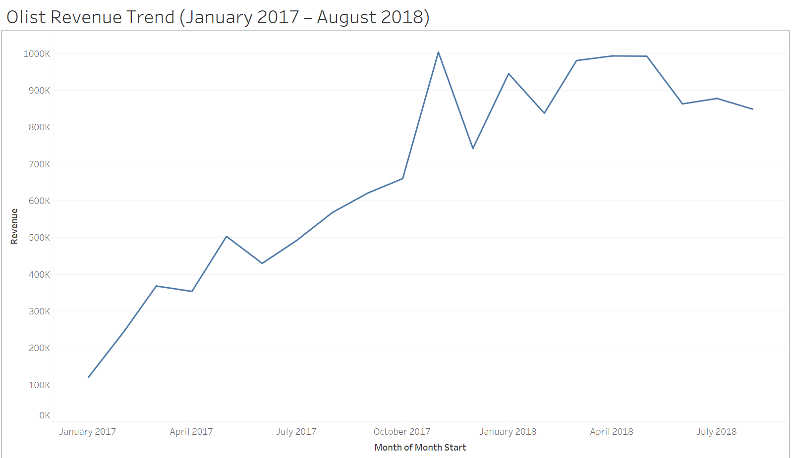
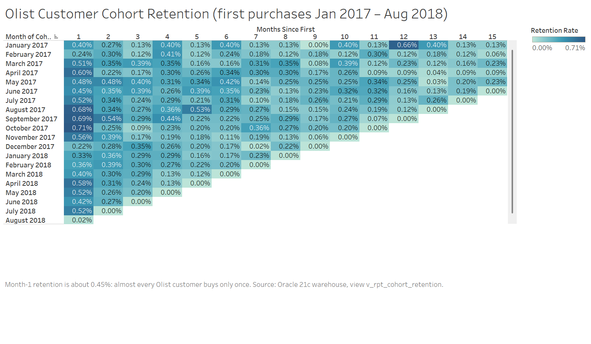

# Retail Sales Data Warehouse (Oracle 21c · PL/SQL · Bash · Tableau)

A star-schema data warehouse built on the [Olist Brazilian E-Commerce](https://www.kaggle.com/datasets/olistbr/brazilian-ecommerce) public dataset: **~100K orders (112,650 order line items), 96K customers, 33K products, 3K sellers, Sep 2016 – Oct 2018**.

The raw CSV files are loaded by PL/SQL packages (external tables → staging → `MERGE` into 5 dimensions and 1 fact, SCD Type 2 on customers, `BULK COLLECT … LIMIT` + `FORALL … SAVE EXCEPTIONS`, an autonomous-transaction error log). The loads run nightly from cron through a Bash wrapper with a lock file and log rotation. 12 SQL report views answer business questions and feed two Tableau Public dashboards.

Everything runs in Docker: nothing needs to be installed on the host except Docker Desktop (and Git Bash on Windows).

## Architecture

```
 data/raw/*.csv (Olist)          data/delta/customer_delta.csv (SCD2 change feed)
        │                                   │
        ▼                                   ▼
 ┌──────────────────────────── Oracle 21c XE (schema DW) ────────────────────────────┐
 │  external tables ──► staging tables ──► dim_date        (generated, 1,461 days)  │
 │   (read the CSVs)    (all VARCHAR2,      dim_customer    (SCD Type 2)             │
 │                       truncate+reload)   dim_product / dim_seller / dim_payment_type
 │        pkg_stage                         pkg_dim (MERGE)         │                │
 │                                                                  ▼                │
 │                                          fact_sales (grain: one order line)       │
 │                                          pkg_fact (BULK COLLECT + FORALL MERGE)   │
 │  pkg_log ──► etl_batch, etl_error_log                            │                │
 │  (autonomous transactions)                                       ▼                │
 │                                          12 report views v_rpt_*                  │
 └──────────────────────────────────────────────────────────────────┼────────────────┘
        ▲ sqlplus                                                   │ sqlplus spool
 ┌──────┴──────────────────── tools container (Debian, Bash, sqlplus, cron) ─────────┐
 │  cron 02:00 ─► bin/nightly_load.sh ─► pkg_etl.run_full_load                       │
 │                 lock file (stale-PID check) · timestamped log · keep last 14      │
 │  bin/export_tableau.sh ─► tableau/revenue_trend.csv, tableau/cohort_retention.csv ─┼─► Tableau Public
 └────────────────────────────────────────────────────────────────────────────────────┘
```

## Run it in 5 commands

**Before you start:** Docker Desktop is running, and the Kaggle dataset is unzipped into `data/raw/` (9 `olist_*.csv` files; they are not in the repo because of their size and licence). On Windows, run the commands from Git Bash.

```bash
cp .env.example .env                               # 1. then edit the two passwords in .env
./bin/up.sh                                        # 2. start Oracle + tools; waits until the DW user can log in
docker compose exec tools bin/install.sh           # 3. create tables, date dimension, packages, views
docker compose exec tools bin/nightly_load.sh      # 4. full load (about 20-25 s); prints one summary line
docker compose exec tools tests/run_all.sh         # 5. optional: 79-check test suite (rebuilds the schema from empty)
```

Then, if you like:

```bash
docker compose exec tools bin/make_delta.sh             # build the SCD2 change feed from the raw data
docker compose exec tools bin/nightly_load.sh --delta   # apply it: 249 customers get a version 2
docker compose exec tools bin/export_tableau.sh         # refresh the Tableau CSVs
docker compose exec tools bin/sql.sh -c "SELECT * FROM v_rpt_revenue_grouping_sets;"
./bin/down.sh                                           # stop (data is kept in a Docker volume)
```

cron runs the full load every night at 02:00 in the `TZ` set in `.env` (see `cron/nightly.cron`). Each run writes `logs/nightly/nightly_YYYYMMDD_HHMMSS.log`. The wrapper's exit code is 0 success, 1 failed, 2 rows rejected, 3 skipped (another load is running), 4 bad arguments.

## The data model

**Grain of `fact_sales`: one row per line item of each order** (112,650 rows). Measures: `price`, `freight_value`.

| Table | Rows | Key | Notes |
|---|---:|---|---|
| `fact_sales` | 112,650 | (order_id, order_item_id) | 7 foreign keys; bitmap indexes on low-cardinality keys |
| `dim_date` | 1,461 | date_key = YYYYMMDD | conformed, role-playing: order, delivered and estimated-delivery date |
| `dim_customer` | 96,096 people | sequence | **SCD Type 2** on zip/city/state (effective_from, effective_to, is_current, version) |
| `dim_product` | 32,951 | sequence | Type 1; English category names |
| `dim_seller` | 3,095 | sequence | Type 1 |
| `dim_payment_type` | 5 | sequence | Type 1; each order's primary (largest) payment method |

Every dimension except `dim_date` has a `-1 Unknown` row, so a sale is never lost for want of a dimension row.

## The 12 report views

| View | Business question | SQL features |
|---|---|---|
| `v_rpt_monthly_revenue` | How is revenue trending month by month, versus the previous month, and year to date? | CTE, LAG, SUM OVER |
| `v_rpt_revenue_state_category` | Which customer states and product categories drive revenue, with subtotals? | ROLLUP, GROUPING |
| `v_rpt_payment_mix_monthly` | How does the share of card, boleto, voucher and debit revenue shift by month? | CTE, PIVOT |
| `v_rpt_top_categories_by_state` | What are the top 3 categories by revenue in each state? | CTE, RANK |
| `v_rpt_seller_rank_in_state` | Who are the 10 leading sellers per state, and their share of state revenue? | CTE, RANK, SUM OVER |
| `v_rpt_cohort_retention` | Of customers who first bought in month X, what % bought again N months later? | CTEs, MIN OVER |
| `v_rpt_late_delivery_cube` | What share of orders arrived late, by state and year, with all subtotals? | CTE, CUBE, GROUPING_ID |
| `v_rpt_category_quarter_pivot` | How does each category's revenue compare across the quarters of 2017–2018? | CTE, PIVOT |
| `v_rpt_repeat_purchase_gap` | For repeat customers, how many days pass between orders? | CTEs, ROW_NUMBER, LAG, LEAD |
| `v_rpt_revenue_grouping_sets` | What is revenue by year, by payment type, and in total, in one result? | GROUPING SETS |
| `v_rpt_weekday_orders_pivot` | Which weekday gets the most orders, 2017 vs 2018? | CTE, PIVOT |
| `v_rpt_customer_moves` | Which customers changed address, from where to where, and when? (SCD2) | CTE, LAG OVER |

## Dashboards

Built in Tableau Public from `tableau/*.csv`; step-by-step instructions are in [tableau/GUIDE.md](tableau/GUIDE.md).

**Revenue Trend**: monthly revenue, month-over-month growth, 2017 vs 2018 year-to-date, KPIs.
<!-- Screenshot: add docs/screenshots/revenue_trend.png (GUIDE.md step 57), then remove this comment. -->


**Customer Cohort Retention**: retention heatmap by first-purchase month, average retention curve, cohort sizes.
<!-- Screenshot: add docs/screenshots/cohort_retention.png (GUIDE.md step 57), then remove this comment. -->


Live workbook: *link to be added after publishing to Tableau Public*.

## What the data shows
- Revenue grew from R$ 6.1M in 2017 to R$ 7.3M in Jan–Aug 2018. The peak is November 2017 (Black Friday, 24 Nov: 1,166 orders in a day).
- About 97 % of customers order only once; month-1 retention is ~0.45 %.
- Late deliveries rose from 5.65 % of delivered orders in 2017 to 7.73 % in 2018.

## Testing

`tests/run_all.sh` rebuilds the schema from empty and runs **79 PASS/FAIL checks**:
- the schema, and row counts and totals reconciled with the CSVs;
- idempotency: a rerun changes nothing (checked by a fingerprint that includes every row's last batch id);
- a deliberately broken input file: exactly the 4 planted bad rows are logged by key and skipped;
- a missing file: the batch is FAILED, the error is logged, and the next run recovers;
- a live lock, a stale lock and log rotation;
- SCD2 versioning and invariants;
- a batch abandoned by a killed process;
- all 12 views return rows;
- the Tableau exports.

## Repository

```
bin/             up.sh, down.sh, install.sh, sql.sh, nightly_load.sh, make_delta.sh, export_tableau.sh
cron/            nightly.cron
docker/          tools container (Debian + Instant Client + cron); Oracle first-start init scripts
sql/ddl/         external, staging, dimension and fact tables, sequences, indexes, date dimension
sql/packages/    pkg_log, pkg_stage, pkg_dim, pkg_fact, pkg_etl
sql/views/       the 12 report views
sql/delta/       SCD2 delta extract generator     sql/export/  Tableau CSV exports
tableau/         the two data sources + GUIDE.md
tests/           run_all.sh
DESIGN.md        full design, including what changed during the build and why
```

## Data licence
Olist Brazilian E-Commerce Public Dataset, Kaggle, [CC BY-NC-SA 4.0](https://creativecommons.org/licenses/by-nc-sa/4.0/). Not included in this repository; download it from Kaggle.
